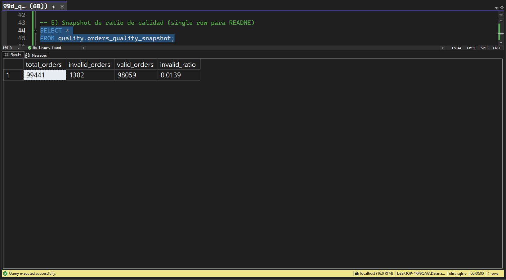

# Olist e-commerce — SQL Server build (raw → clean → quality → BI)

## Goal
Reproducible, portfolio-oriented project that builds an end-to-end data flow in **SQL Server**:  
**raw ingestion**, **clean standardization**, **data-quality controls with quality-safe views**, and a **BI semantic layer** ready for dashboards.

---

## Dataset
**Olist e-commerce** (public).  
SQL is provided for demo/portfolio purposes; dataset ownership remains with the original authors.

---

## Table of Contents

- [Layered architecture](#layered-architecture)
- [Conventions](#conventions)
- [Quick start (runbook)](#quick-start-runbook)
- [Required privileges](#required-privileges)
- [ERD (clean)](#erd-clean)
- [Data-quality controls & published views](#data-quality-controls--published-views)
  - [Violation codes (time logic)](#violation-codes-time-logic)
  - [Key `quality.*` views](#key-quality-views)
  - [Validation & KPI snapshot](#validation--kpi-snapshot)
  - [Deep / Sanity Checks (full set)](#deep--sanity-checks-full-set)
- [BI layer (overview)](#bi-layer-overview)
  - [Glossary (short)](#glossary-short)
  - [Dependencies](#dependencies)
- [Troubleshooting](#troubleshooting)
- [Credits & license](#credits--license)

---

## Layered architecture

| **Order** | **Folder**                  | **Purpose**                                                                                                        | **README**                                    |
| --------: | --------------------------- | ------------------------------------------------------------------------------------------------------------------ | --------------------------------------------- |
|    **00** | `sql_server/00_environment` | Initial setup (DB, schemas, types, utilities).                                                                     | [open](./sql_server/00_environment/README.md) |
|    **01** | `sql_server/01_raw`         | Load raw tables (source-faithful mirror).                                                                          | [open](./sql_server/01_raw/README.md)         |
|    **02** | `sql_server/02_clean`       | Cleaning/standardization and trusted PK/FK.                                                                        | [open](./sql_server/02_clean/README.md)       |
|    **99** | `sql_server/99_quality`     | QA: sanity & deep checks + publish **quality.\*** (invalid IDs, valid subsets, repaired timestamps, KPI snapshot). | [open](./sql_server/99_quality/README.md)     |
|    **03** | `sql_server/03_bi`          | BI semantic layer **bi.\*** and showcase queries (KPIs, lead time, payment mix, repeaters).                        | [open](./sql_server/03_bi/README.md)          |

--- 

## Conventions

- **Naming**: `lower_snake_case`  
- **Idempotent scripts**: `CREATE OR ALTER`  
- **Percentiles** (SQL Server 2019+): `PERCENTILE_CONT`  
- All scripts assume **SQLCMD Mode** enabled in SSMS / Azure Data Studio.  

---

## Quick start (runbook)

Recommended order: `00 → 01 → 02 → 99 → 03`.

Enable **SQLCMD Mode** and run from the repo root:

```sql
USE olist_sqlsrv;

-- 00) Environment
:r .\sql_server\00_environment\00_create_database_and_schemas.sql

-- 01) Raw (see 01_raw README for exact names)
:r .\sql_server\01_raw\01_create_raw_tables.sql

-- 02) Clean (PK/FK creation and domain normalization)
:r .\sql_server\02_clean\02a_build_clean_tables.sql

-- 99) Quality (QA + quality.* views)
:r .\sql_server\99_quality\99a_quality_checks.sql
:r .\sql_server\99_quality\99b_quality_deep_checks.sql
:r .\sql_server\99_quality\99c_quality_fixes.sql
:r .\sql_server\99_quality\99d_quality_sanity_checks.sql

-- 03) BI (bi.* views and README queries)
:r .\sql_server\03_bi\03a_publish_bi_views.sql
:r .\sql_server\03_bi\03b_bi_readme_queries.sql
:r .\sql_server\03_bi\03c_bi_extra_views.sql
:r .\sql_server\03_bi\03d_bi_extra_readme_queries.sql
```
---

## Required privileges

- **CREATE SCHEMA**, **CREATE VIEW** (schemas `quality`, `bi`)
- **ALTER TABLE ... WITH CHECK CHECK CONSTRAINT** (schema `clean`)

---

## ERD (clean)

- **Model**: [open](./sql_server/99_quality/screenshots/readme_00_model_clean.png)  
- **PK/FK**: [open](./sql_server/99_quality/screenshots/readme_00_model_clean_keys.png)

---

## Data-quality controls & published views

### Violation codes (time logic)

- **T1** — `approved_at < purchase_timestamp`
- **T2** — `carrier_date < approved_at`
- **T3** — `customer_date < carrier_date`
- **T4** — `customer_date < purchase_timestamp`

---

## Key `quality.*` views

| **View**                            | **Summary**                                                                      |
| ----------------------------------- | -------------------------------------------------------------------------------- |
| `quality.invalid_orders_time_logic` | One row per time-logic violation (T1–T4).                                        |
| `quality.invalid_orders_ids`        | Distinct `order_id` with at least one violation.                                 |
| `quality.invalid_orders_summary`    | Count by violation type/description.                                             |
| `quality.valid_orders`              | `clean.orders` minus invalid orders.                                             |
| `quality.order_items_valid`         | `clean.order_items` scoped to valid orders.                                      |
| `quality.payments_valid`            | `clean.payments` scoped to valid orders.                                         |
| `quality.orders_repaired`           | **Monotonic** timestamp fixes (`*_fixed` columns) without mutating `clean.*`.    |
| `quality.orders_quality_snapshot`   | One-row KPIs: `total_orders`, `invalid_orders`, `valid_orders`, `invalid_ratio`. |

---

## Validation & KPI snapshot

  

👉 For the **full validation set** (invalid orders, reconciliation, repaired checks, violation breakdown, etc.), see [99_quality/README](./sql_server/99_quality/README.md).

---

## Deep / Sanity Checks (full set)

Detailed screenshots for:
- Sanity counts & orphans
- Uniqueness dups
- Nulls in keys
- Domain/range violations
- Time logic violations
- Economic consistency diffs
- FK trusted status
- Published views list

👉 See the complete documentation in [99_quality/README](./sql_server/99_quality/README.md).

---

## BI layer (overview)

### Core views
- `bi.v_orders_core`  
- `bi.v_order_items_enriched`  
- `bi.v_payments_per_order`  
- `bi.v_daily_sales`  
- `bi.v_delivery_lead_time`  
- `bi.v_late_orders`  
- `bi.v_payment_mix`  
- `bi.v_kpi_summary`  
- `bi.v_category_sales_monthly`  
- `bi.v_state_lead_time`  
- `bi.v_repeat_customers`  

---

### Glossary (short)

- **lead_time_days** — days between `order_purchase_timestamp` and `actual_delivery_date` (after fixes)  
- **late_flag** — `1` if `actual_delivery_date > estimated_delivery_date` (inclusive end-of-day)  
- **gross_sales** — `price + freight_value` (pre-discounts; aggregated per view)  
- **payment mix** — % by transactions and by amount (`bi.v_payment_mix`)  
- **unknown** — normalized fallback when `product_category` or `payment_type` is missing/blank  
- **is_delivered** — `1` when the order is delivered (base filter for sales/lead-time views)  

## Dependencies

- **BI layer** consumes:  
  - `quality.*` → e.g., `quality.valid_orders`, `quality.order_items_valid`, `quality.payments_valid`  
  - `clean.*` → standardized tables (customer, product, geo, etc.)  

This ensures analytics are always based on **validated and repaired data**, not directly on raw ingestion.

---

### Troubleshooting

- **RAW vs CLEAN row-count mismatches in 99a** → revisit `02_clean` transforms  
- **Non-zero findings in 99b** → are flags; fix upstream or rely on `quality.orders_repaired` for analytics  
- **Any FK with `is_not_trusted = 1`** → re-run with `WITH CHECK CHECK CONSTRAINT`  
- **`still_bad_after_fix > 0` (99d-03)** → should be 0; otherwise inspect edge timestamps  

---

## Credits & License

- **Dataset**: Olist e-commerce (public)  
- **SQL**: provided for portfolio/demo purposes  
- **Ownership**: belongs to the original authors
- **License:** see **MIT** 


