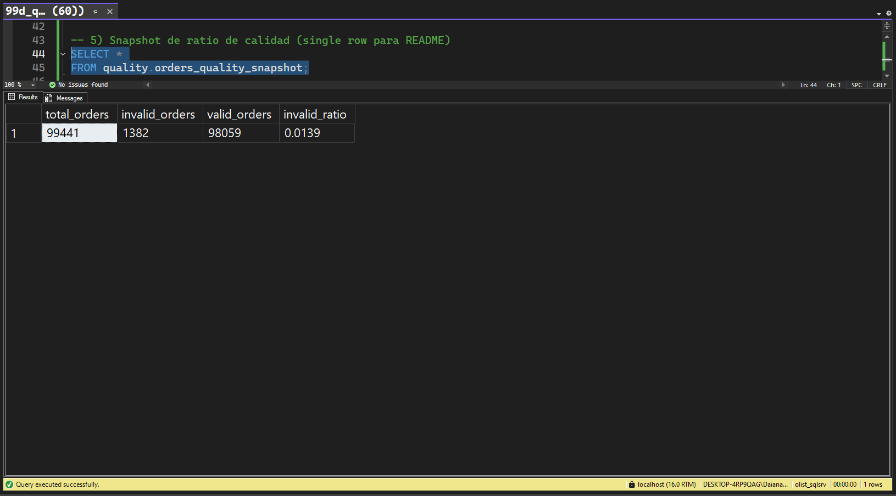

# Olist e-commerce — Proyecto SQL Server (raw → clean → quality → BI)

## Objetivo

Proyecto reproducible y orientado a portfolio que construye un flujo de datos end-to-end en **SQL Server**:

**ingesta raw**, **limpieza y estandarización**, **controles de calidad de datos con vistas seguras**, y una **capa semántica BI** lista para dashboards.

---

## Dataset

**Olist e-commerce** dataset público.

El código SQL se proporciona con fines de demo y portfolio. La propiedad del dataset pertenece a sus autores originales.

---

## Tabla de contenidos

- [Insights ejecutivos SQL: calidad de datos, entregas y vistas listas para BI](./docs/analysis/insights.md)
- [Arquitectura por capas](#arquitectura-por-capas)
- [Convenciones](#convenciones)
- [Quick start / Runbook](#quick-start--runbook)
- [Privilegios requeridos](#privilegios-requeridos)
- [ERD clean](#erd-clean)
- [Controles de calidad de datos y vistas publicadas](#controles-de-calidad-de-datos-y-vistas-publicadas)
  - [Códigos de violación lógica temporal](#códigos-de-violación-lógica-temporal)
  - [Vistas principales quality.*](#vistas-principales-quality)
  - [Validación y snapshot de KPIs](#validación-y-snapshot-de-kpis)
  - [Deep checks / Sanity checks](#deep-checks--sanity-checks)
- [Capa BI](#capa-bi)
  - [Glosario breve](#glosario-breve)
  - [Dependencias](#dependencias)
- [Troubleshooting](#troubleshooting)
- [Créditos y licencia](#créditos-y-licencia)

---

## Arquitectura por capas

| **Orden** | **Carpeta**                 | **Propósito**                                                                                                      | **README**                                    |
| --------: | --------------------------- | ------------------------------------------------------------------------------------------------------------------ | --------------------------------------------- |
|    **00** | `sql_server/00_environment` | Configuración inicial: base de datos, esquemas, tipos y utilidades.                                                | [abrir](./sql_server/00_environment/README.md) |
|    **01** | `sql_server/01_raw`         | Carga de tablas raw, manteniendo la estructura fiel a la fuente original.                                          | [abrir](./sql_server/01_raw/README.md)         |
|    **02** | `sql_server/02_clean`       | Limpieza, estandarización y creación de claves PK/FK confiables.                                                   | [abrir](./sql_server/02_clean/README.md)       |
|    **99** | `sql_server/99_quality`     | QA: sanity checks, deep checks y publicación de vistas `quality.*` para datos válidos, inválidos y reparados.      | [abrir](./sql_server/99_quality/README.md)     |
|    **03** | `sql_server/03_bi`          | Capa semántica BI `bi.*` y consultas showcase: KPIs, lead time, payment mix y clientes recurrentes.                | [abrir](./sql_server/03_bi/README.md)          |

---

## Convenciones

- **Naming:** `lower_snake_case`
- **Scripts idempotentes:** `CREATE OR ALTER`
- **Percentiles SQL Server 2019+:** `PERCENTILE_CONT`
- Todos los scripts asumen **SQLCMD Mode** habilitado en SSMS / Azure Data Studio.

---

## Quick start / Runbook

Orden recomendado de ejecución:

`00 → 01 → 02 → 99 → 03`

Habilitar **SQLCMD Mode** y ejecutar desde la raíz del repositorio:

```sql
USE olist_sqlsrv;

-- 00) Environment
:r .\sql_server\00_environment\00_create_database_and_schemas.sql

-- 01) Raw
-- Ver README de 01_raw para nombres exactos de archivos
:r .\sql_server\01_raw\01_create_raw_tables.sql

-- 02) Clean
-- Construcción de tablas limpias, PK/FK y normalización de dominios
:r .\sql_server\02_clean\02a_build_clean_tables.sql

-- 99) Quality
-- Controles de calidad, deep checks, fixes y sanity checks
:r .\sql_server\99_quality\99a_quality_checks.sql
:r .\sql_server\99_quality\99b_quality_deep_checks.sql
:r .\sql_server\99_quality\99c_quality_fixes.sql
:r .\sql_server\99_quality\99d_quality_sanity_checks.sql

-- 03) BI
-- Publicación de vistas BI y consultas de ejemplo
:r .\sql_server\03_bi\03a_publish_bi_views.sql
:r .\sql_server\03_bi\03b_bi_readme_queries.sql
:r .\sql_server\03_bi\03c_bi_extra_views.sql
:r .\sql_server\03_bi\03d_bi_extra_readme_queries.sql
```

---

## Privilegios requeridos

- **CREATE SCHEMA**
- **CREATE VIEW** para los esquemas `quality` y `bi`
- **ALTER TABLE ... WITH CHECK CHECK CONSTRAINT** sobre el esquema `clean`

---

## ERD clean

- **Modelo:** [abrir](./sql_server/99_quality/screenshots/readme_00_model_clean.png)
- **PK/FK:** [abrir](./sql_server/99_quality/screenshots/readme_00_model_clean_keys.png)

---

## Controles de calidad de datos y vistas publicadas

La capa `quality.*` permite identificar registros inválidos, validar reglas de negocio, reparar inconsistencias temporales sin modificar las tablas limpias y generar vistas seguras para análisis.

---

### Códigos de violación lógica temporal

| **Código** | **Regla detectada** |
| ---------- | ------------------- |
| **T1** | `approved_at < purchase_timestamp` |
| **T2** | `carrier_date < approved_at` |
| **T3** | `customer_date < carrier_date` |
| **T4** | `customer_date < purchase_timestamp` |

---

## Vistas principales `quality.*`

| **Vista**                            | **Descripción** |
| ----------------------------------- | --------------- |
| `quality.invalid_orders_time_logic` | Una fila por cada violación de lógica temporal T1-T4. |
| `quality.invalid_orders_ids`        | Lista única de `order_id` con al menos una violación. |
| `quality.invalid_orders_summary`    | Conteo por tipo de violación y descripción. |
| `quality.valid_orders`              | Órdenes válidas: `clean.orders` excluyendo órdenes inválidas. |
| `quality.order_items_valid`         | Items asociados únicamente a órdenes válidas. |
| `quality.payments_valid`            | Pagos asociados únicamente a órdenes válidas. |
| `quality.orders_repaired`           | Reparación monotónica de timestamps mediante columnas `*_fixed`, sin modificar `clean.*`. |
| `quality.orders_quality_snapshot`   | KPIs en una sola fila: `total_orders`, `invalid_orders`, `valid_orders`, `invalid_ratio`. |

---

## Validación y snapshot de KPIs



Para ver el set completo de validaciones — órdenes inválidas, reconciliación, checks después de reparación, desglose de violaciones, entre otros — consultar:

[99_quality/README](./sql_server/99_quality/README.md)

---

## Deep checks / Sanity checks

El proyecto incluye documentación detallada con screenshots para:

- Conteos generales y detección de orphans
- Duplicados en campos únicos
- Nulos en claves
- Violaciones de dominio y rango
- Violaciones de lógica temporal
- Diferencias de consistencia económica
- Estado de confianza de claves foráneas
- Listado de vistas publicadas

Ver documentación completa en:

[99_quality/README](./sql_server/99_quality/README.md)

---

## Capa BI

La capa `bi.*` publica vistas listas para consumo analítico y construcción de dashboards.

Estas vistas permiten analizar ventas, pagos, entregas, lead time, órdenes tardías, categorías, estados y clientes recurrentes.

---

### Vistas principales

- `bi.v_orders_core`
- `bi.v_order_items_enriched`
- `bi.v_payments_per_order`
- `bi.v_daily_sales`
- `bi.v_delivery_lead_time`
- `bi.v_late_orders`
- `bi.v_payment_mix`
- `bi.v_kpi_summary`
- `bi.v_category_sales_monthly`
- `bi.v_state_lead_time`
- `bi.v_repeat_customers`

---

## Glosario breve

- **lead_time_days:** días entre `order_purchase_timestamp` y `actual_delivery_date`, utilizando fechas corregidas cuando corresponde.
- **late_flag:** valor `1` cuando `actual_delivery_date > estimated_delivery_date`, considerando el fin del día estimado.
- **gross_sales:** `price + freight_value`, agregado según la vista correspondiente.
- **payment mix:** distribución porcentual por tipo de pago, tanto por cantidad de transacciones como por monto.
- **unknown:** valor normalizado utilizado cuando `product_category` o `payment_type` está vacío o nulo.
- **is_delivered:** valor `1` cuando la orden fue entregada. Se usa como filtro base para vistas de ventas y lead time.

---

## Dependencias

La capa BI consume principalmente:

- `quality.*`
  - Ejemplos: `quality.valid_orders`, `quality.order_items_valid`, `quality.payments_valid`
- `clean.*`
  - Tablas estandarizadas de clientes, productos, geografía, órdenes, pagos e items

Esto asegura que los análisis se basen en datos validados y reparados, no directamente en la ingesta raw.

---

## Troubleshooting

- **Diferencias de conteo entre RAW y CLEAN en 99a:** revisar las transformaciones de `02_clean`.
- **Hallazgos distintos de cero en 99b:** son alertas de calidad; corregir upstream o utilizar `quality.orders_repaired` para análisis.
- **FK con `is_not_trusted = 1`:** volver a ejecutar las constraints con `WITH CHECK CHECK CONSTRAINT`.
- **`still_bad_after_fix > 0` en 99d-03:** debería ser 0. Si no lo es, revisar timestamps extremos o casos borde.

---

## Créditos y licencia

- **Dataset:** Olist e-commerce público
- **SQL:** desarrollado con fines de portfolio y demostración
- **Propiedad del dataset:** pertenece a sus autores originales
- **Licencia:** ver archivo **MIT**


