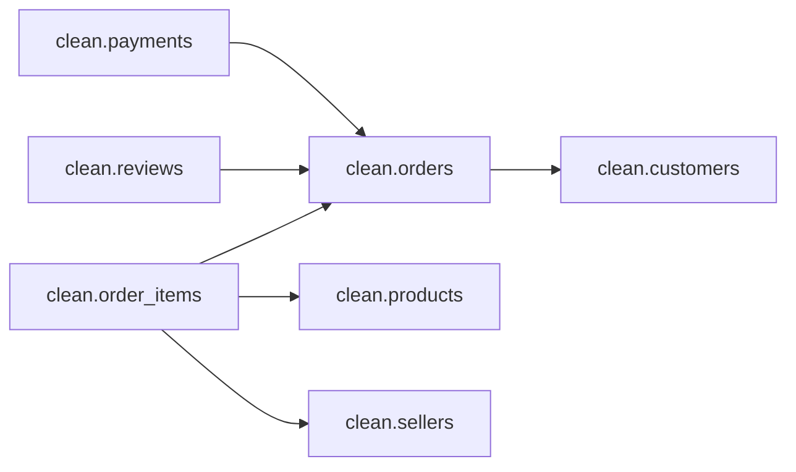

# DICTIONARY — 00_environment (SQL Server / Olist)

**Purpose.** Technical documentation of the database bootstrap and the model snapshot used to verify structure, integrity, and dependencies.

---

## 1) Scope
- **Database:** `olist_sqlsrv` (collation `Latin1_General_100_CI_AI_SC`, recovery model `SIMPLE`).
- **Layers (schemas):**
  - `raw` → raw CSV ingestion (no typing).
  - `clean` → typed, deduplicated data with PK/FK and integrity rules.
  - `bi` → BI-ready views (star-schema oriented for reporting).
  - `quality` → (published in its own layer) quality & reconciliation views/tests.
- **Read-only snapshot:** row counts, objects/columns, PKs, FKs, view dependencies, and ER edges (DOT).

---

## 2) Requirements
- SQL Server **2019+** (or Azure SQL DB).
- SSMS or Azure Data Studio.
- Permissions to create a database, schemas, and read system catalogs.

---

## 3) Run order (scripts)
| Order | Script | Description | Idempotent | Side effects |
|---:|---|---|:--:|---|
| 00  | `00_create_database_and_schemas.sql` | Creates DB and schemas (`raw`, `clean`, `bi`). Keeps `SIMPLE`. | Yes | None (creates only if missing). |
| 00z | `00z_model_snapshot.sql` | Technical reports (grids + DOT edges). | Yes | Read-only (no destructive DDL). |

> Next recommended: `00c_security_roles.sql` → role **`bi_reader`** with `GRANT SELECT` on `bi` and `quality`.

---

## 4) How to run
```sql
-- 1) Create database and schemas
:r .\sql_server\00_environment\00_create_database_and_schemas.sql

-- 2) Take a read-only model snapshot (auditing)
USE olist_sqlsrv;
:r .\sql_server\00_environment\00z_model_snapshot.sql
```
## 5) Design & conventions
- **Naming:** `snake_case` for tables/columns; business layers split by schema.
- **Types (clean):** textual IDs as `nvarchar`; state as `nchar(4)`; dates `datetime2(6)`; amounts `decimal(12,2)`.
- **Integrity:** every `clean` table has a **PK**; **FKs** enforce core business relationships.
- **Re-runnable:** `IF NOT EXISTS … CREATE`; explicit `USE …`; snapshot is safe to re-run.

## 6) Current structure — `clean` layer (snapshot)
### Tables
`customers`, `geolocation`, `order_items`, `orders`, `payments`, `products`, `reviews`, `sellers`.

### Primary Keys
- `customers`(**customer_id**)
- `geolocation`(**geolocation_zip_code_prefix**, **geolocation_city**, **geolocation_state**)
- `order_items`(**order_id**, **order_item_id**)
- `orders`(**order_id**)
- `payments`(**order_id**, **payment_sequential**)
- `products`(**product_id**)
- `reviews`(**review_id**)
- `sellers`(**seller_id**)

### Foreign Keys (main)
- `order_items.order_id` → `orders.order_id`
- `order_items.product_id` → `products.product_id`
- `order_items.seller_id` → `sellers.seller_id`
- `orders.customer_id` → `customers.customer_id`
- `payments.order_id` → `orders.order_id`
- `reviews.order_id` → `orders.order_id`

## 7) Snapshot outputs (expected grids)
1) **Row counts** per schema/table — sanity check after loads.  
2) **Objects & Columns** — inventory with data type, length/precision, nullability.  
3) **PKs in `clean`** — constraint name and column order.  
4) **FKs to/from `clean`** — parent/ref tables & columns (and actions if defined).  
5) **View dependencies** (`bi`/`quality` → `clean`/`raw`) — impact mapping.  
6) **ER edges (DOT)** — quick graph for ER visualization.

**ER DOT (current sample):**
clean.order_items -> clean.orders;
clean.order_items -> clean.products;
clean.order_items -> clean.sellers;
clean.orders      -> clean.customers;
clean.payments    -> clean.orders;
clean.reviews     -> clean.orders;

**ER diagram (Mermaid):**


-->

---

## 8) Interpretation notes
- **Structural consistency:** PK/FK lists reflect **actual** referential integrity, not assumptions.  
- **BI-readiness:** the `clean` → `bi` separation accelerates star-schema views and reduces coupling.  
- **Operability:** snapshot enables quick diffs between runs to detect structure/dependency regressions.

---

## 9) Validation checklist
- [ ] Correct collation in `olist_sqlsrv`.  
- [ ] Schemas `raw`, `clean`, `bi` exist.  
- [ ] Every `clean` table has a **PK** (including composites).  
- [ ] Main **FKs** exist and resolve to valid objects.  
- [ ] `bi` / `quality` view dependencies map cleanly (no orphaned references).  
- [ ] ER DOT edges cover the intended business relationships.

---

## 10) Security (plan)
Create a read-only role for analytics and grant schema-level access:

```sql
CREATE ROLE bi_reader AUTHORIZATION dbo;
GRANT SELECT ON SCHEMA::bi      TO bi_reader;
GRANT SELECT ON SCHEMA::quality TO bi_reader;  -- when the quality schema is present
```


