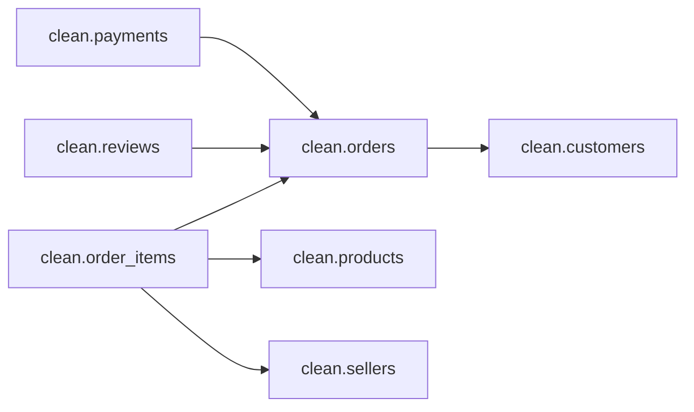

# 02_clean — Typed, constrained, and indexed layer (SQL Server)

**Purpose.** Build the `clean` schema from `raw` with proper data types, primary/foreign keys, quality checks, and helper indexes. Includes delivery KPIs.

---

## What it does
- Rebuilds the `clean` layer idempotently (drops/creates tables and refreshes constraints).
- Normalizes text to `NVARCHAR` for Unicode safety.
- Adds **PKs**, **FKs**, **CHECK** constraints, and **indexes**.
- Computes delivery KPIs in `clean.orders`:
  - `delivered_delay_days` = days from purchase to delivered.
  - `estimated_delay_days` = days from purchase to estimated delivery.
  - `delivered_on_time` = delivered ≤ estimated date **inclusive** (uses `+1 day`).

---

## Scripts & order
| Order | Script                        | Description                                  | Idempotent |
|-----:|--------------------------------|----------------------------------------------|:--:|
| 02a  | [`02a_build_clean_tables.sql`](./02a_build_clean_tables.sql)   | Rebuilds all `clean.*` tables, PK/FK, checks, and indexes | Yes |

> Depends on `01_raw` completed and populated.

---

## Prerequisites
- SQL Server 2019+ (or Azure SQL DB)
- `01_raw` executed and populated

## Repo run order
`00_environment` → `01_raw` → `02_clean`

---

## How to run
```sql
USE olist_sqlsrv;
:r .\sql_server\02_clean\02a_build_clean_tables.sql
```
### Inputs (from `raw`)
- `raw.geolocation`
- `raw.customers`
- `raw.sellers`
- `raw.products`
- `raw.product_category_name_translation`
- `raw.orders`
- `raw.order_items`
- `raw.payments`
- `raw.reviews`

---

### Outputs (in `clean`)

#### Tables & PKs
- **clean.geolocation** — **PK** (`geolocation_zip_code_prefix`, `geolocation_city`, `geolocation_state`)  
  *Canonical lat/lng averaged per (zip, city, state).*
- **clean.customers** — **PK** (`customer_id`)
- **clean.sellers** — **PK** (`seller_id`)
- **clean.products** — **PK** (`product_id`) *(includes translated `product_category_name_english`)*
- **clean.orders** — **PK** (`order_id`) + KPIs (`delivered_delay_days`, `estimated_delay_days`, `delivered_on_time`)
- **clean.order_items** — **PK** (`order_id`, `order_item_id`)
- **clean.payments** — **PK** (`order_id`, `payment_sequential`)
- **clean.reviews** — **PK** (`review_id`)

#### Foreign keys
- `clean.orders.customer_id` → `clean.customers.customer_id`
- `clean.order_items.order_id` → `clean.orders.order_id`
- `clean.order_items.product_id` → `clean.products.product_id`
- `clean.order_items.seller_id` → `clean.sellers.seller_id`
- `clean.payments.order_id` → `clean.orders.order_id`
- `clean.reviews.order_id` → `clean.orders.order_id`

#### Indexes
- `IX_clean_customers_zip (customer_zip_code_prefix)`
- `IX_clean_sellers_zip (seller_zip_code_prefix)`
- `IX_clean_products_cat_en (product_category_name_english)`
- `IX_clean_orders_customer (customer_id)`
- `IX_clean_order_items_product (product_id)`
- `IX_clean_order_items_seller (seller_id)`
- `IX_clean_payments_order (order_id)`

#### Quality checks
- `CK_items_nonneg` on `clean.order_items` (`price >= 0 AND freight_value >= 0`)
- `CK_pay_nonneg` on `clean.payments` (`payment_value >= 0 AND payment_installments >= 0`)
- `CK_review_score` on `clean.reviews` (`review_score BETWEEN 1 AND 5`)

---

### Design notes
- **Scope & safety:** affects only `clean.*` (safe to re-run); `raw.*` remains untouched.
- **Unicode:** strings as `NVARCHAR`; states as fixed `NCHAR(2)`.
- **Idempotent rebuild:** drop FK/CHECK constraints first, then drop/create `clean.*`.
- **FK creation:** `WITH NOCHECK` then `WITH CHECK CHECK CONSTRAINT` to validate and mark **TRUSTED**.
- **Typing:** numeric casts with `TRY_CAST/TRY_CONVERT` where applicable in `02a` inserts.
- **Geolocation:** aggregate lat/lng by `(zip, city, state)` to a canonical row.

---

### Quick QA
- `02a` ends with a row-count snapshot across all `clean.*` tables.  
- For a full technical inventory (PK/FK lists, dependencies), use the snapshot script:  
  `00_environment/00z_model_snapshot.sql`.

---

### Troubleshooting
- Ensure `01_raw` tables are populated before running `02a`.
- Long FK validations: approach uses `WITH NOCHECK` then validation to minimize lock time.
- KPI logic is inclusive of estimated date (`DATEADD(day, 1, estimated)`), by design.

---



_See also:_ [00_environment](../00_environment/README.md) · [01_raw](../01_raw/README.md)


