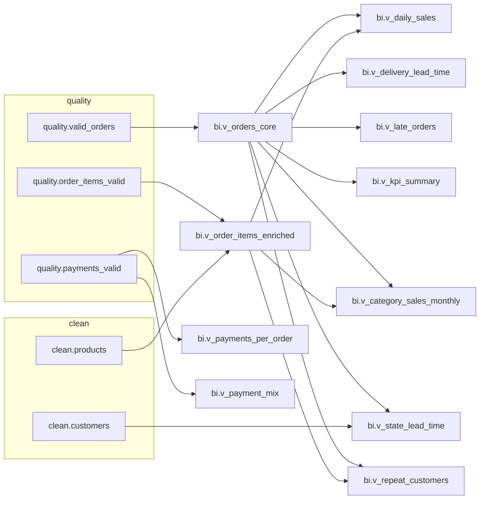

# 03_bi — BI views & showcase queries (SQL Server)

## Purpose 
Publish a small, BI-ready semantic layer (bi schema) built from quality-safe data, plus compact “README queries” to reproduce the screenshots (KPIs, sales, payment mix, late orders, etc.).

## Prerequisites
- SQL Server 2019+ (or Azure SQL DB)
- Layers 01_raw, 02_clean, and 99_quality executed
- This folder assumes 99c_quality_fixes.sql has been applied

## Scripts & order

| Order | Script                                                                 | What it does                                                        | Idempotent |
| :---: | :--------------------------------------------------------------------- | :------------------------------------------------------------------ | :--------: |
|  03a  | [`03a_publish_bi_views.sql`](./03a_publish_bi_views.sql)               | Creates/updates all core BI views in `bi.*`.                        |     Yes    |
|  03b  | [`03b_bi_readme_queries.sql`](./03b_bi_readme_queries.sql)             | Runs compact queries to populate README screenshots.                |     Yes    |
|  03c  | [`03c_bi_extra_views.sql`](./03c_bi_extra_views.sql)                   | Adds extra BI views (category × month, state lead time, repeaters). |     Yes    |
|  03d  | [`03d_bi_extra_readme_queries.sql`](./03d_bi_extra_readme_queries.sql) | Example selects for the extra views (for screenshots).              |     Yes    |

Run order: 00_environment → 01_raw → 02_clean → 99_quality → 03_bi

## How to run

> **Note:** Enable **SQLCMD mode** in SSMS/Azure Data Studio.

```sql
USE olist_sqlsrv;
:r .\sql_server\03_bi\03a_publish_bi_views.sql
:r .\sql_server\03_bi\03b_bi_readme_queries.sql
:r .\sql_server\03_bi\03c_bi_extra_views.sql
:r .\sql_server\03_bi\03d_bi_extra_readme_queries.sql
```

## Inputs (upstream)
- quality.valid_orders, quality.orders_repaired
- quality.order_items_valid, quality.payments_valid
- clean.products, clean.customers

## Screenshot gallery

- KPI summary — [open](./screenshots/readme_06_bi_kpi_summary.png)
- Daily sales — [open](./screenshots/readme_07_bi_daily_sales.png)
- Payment mix — [open](./screenshots/readme_08_bi_payment_mix.png)
- Late orders — [open](./screenshots/readme_09_bi_late_orders.png)
- Lead-time distribution — [open](./screenshots/readme_10_bi_lead_time_dist.png)
- Category × Month sales — [open](./screenshots/readme_11_bi_category_monthly.png)
- Lead time by state — [open](./screenshots/readme_12_bi_state_lead_time.png)
- Repeat customers — [open](./screenshots/readme_13_bi_repeat_customers.png)


## BI views (overview) 

| View (script) | Grain | Summary |
|---|---|---|
| [`bi.v_orders_core`](./03a_publish_bi_views.sql) | 1 row = 1 order | Delivered flag, repaired timestamps, **lead_time_days**, **late_flag**. |
| [`bi.v_order_items_enriched`](./03a_publish_bi_views.sql) | order × item | Items with `product_category` (defaults to `unknown`). |
| [`bi.v_payments_per_order`](./03a_publish_bi_views.sql) | 1 row = 1 order | Sum of payments per order. |
| [`bi.v_daily_sales`](./03a_publish_bi_views.sql) | 1 row = 1 purchase date | Delivered-only revenue metrics by purchase date. |
| [`bi.v_delivery_lead_time`](./03a_publish_bi_views.sql) | 1 row = 1 order | Delivered orders with purchase date + lead time. |
| [`bi.v_late_orders`](./03a_publish_bi_views.sql) | 1 row = 1 order | Delivered orders flagged as **late**. |
| [`bi.v_payment_mix`](./03a_publish_bi_views.sql) | 1 row = 1 payment_type | Volumes and % split by transactions and by amount. |
| [`bi.v_kpi_summary`](./03a_publish_bi_views.sql) | single row | Portfolio KPIs (totals, invalid ratio, late rate, avg lead time). |
| [`bi.v_category_sales_monthly`](./03c_bi_extra_views.sql) | month × category | Delivered-only sales by `month_start` and `product_category`. |
| [`bi.v_state_lead_time`](./03c_bi_extra_views.sql) | 1 row = 1 state | Delivered count, avg/p50/p90 lead time by customer state. |
| [`bi.v_repeat_customers`](./03c_bi_extra_views.sql) | 1 row = 1 customer | Orders count, repeater flag, gross sales per customer. |

---

## Business rules (concise)

- Delivered-only filters are applied where they make analytic sense (sales/lead-time views).
- Late order definition: actual_delivery_date > estimated_delivery_date (inclusive end-of-day).
- Percent splits in v_payment_mix are computed over all rows returned by the view.
- Unknown/blank categories or payment types are normalized to 'unknown'.
- All views are created with CREATE OR ALTER → safe to rerun.

---

## Key terms (glossary)

- **lead_time_days** — days between `order_purchase_timestamp` and `actual_delivery_date` (after timestamp fixes).
- **late_flag** — `1` when `actual_delivery_date` > `estimated_delivery_date` **(inclusive end-of-day)**.
- **gross_sales** — `price + freight_value` (no discounts; summed by each view as needed).
- **payment mix** — percentage split by transactions and by **amount** (see `bi.v_payment_mix`).
- **unknown** — normalized fallback for missing/blank `product_category` or `payment_type`.
- **is_delivered** — `1` when the order is delivered (base filter for sales/lead-time views).

---

## BI dependency map


Upstream inputs from quality.* and clean.* feed bi.* views. Arrows indicate data flow.

---

### 5) Quick QA (sanity checks)
-- 1) Key counts
SELECT
  (SELECT COUNT(*) FROM bi.v_orders_core) AS orders_core,
  (SELECT COUNT(*) FROM bi.v_daily_sales) AS daily_sales_days,
  (SELECT COUNT(*) FROM bi.v_late_orders) AS late_orders,
  (SELECT COUNT(*) FROM bi.v_payment_mix) AS payment_types;

-- 2) Top-line KPIs
SELECT * FROM bi.v_kpi_summary;

-- 3) Nulls check (unexpected?)
SELECT TOP (1) *
FROM bi.v_order_items_enriched
WHERE product_category IS NULL;

---

### 6) Troubleshooting (brief)

- If any view fails: confirm `99c_quality_fixes.sql` ran and that **01_raw**, **02_clean**, and **99_quality** are complete.
- If `WITH CHECK CHECK CONSTRAINT` takes long: run during off-hours; it’s idempotent (safe to re-run).
- If you see blank categories or payment types: they are normalized to `unknown` by design.

---

- See also: [02_clean](../02_clean) · [99_quality](../99_quality)

*Dataset: Olist e-commerce (public). SQL provided for portfolio/demo purposes; dataset ownership remains with the original authors.*


