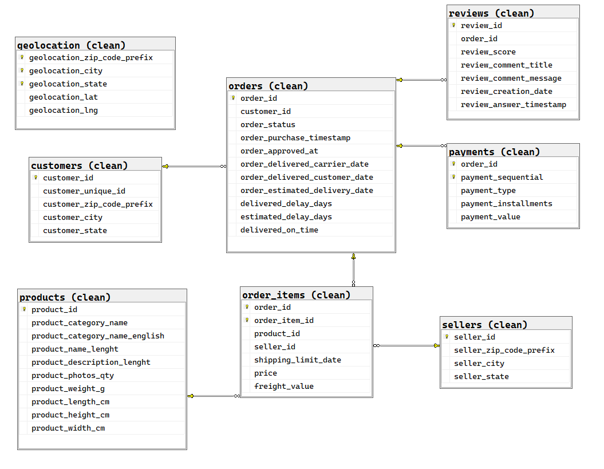
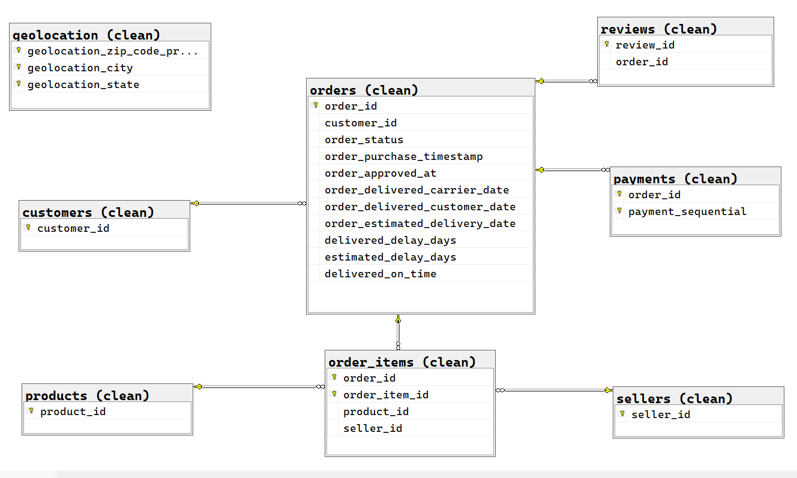

# 99_quality — Data quality checks & “quality-safe” views (SQL Server)
## Purpose
Run sanity/deep data-quality checks over the clean.* layer and publish a small set of quality-safe views under the quality schema (invalid IDs, summaries, valid subsets, repaired timestamps, KPI snapshot).

## Prerequisites

- SQL Server 2019+ (or Azure SQL DB)
- Layers `01_raw` and `02_clean` executed
- Permissions to `CREATE SCHEMA` / `CREATE VIEW` on `quality`, and to `ALTER TABLE ... WITH CHECK CHECK CONSTRAINT` on `clean.*`


**Run order**: 00_environment → 01_raw → 02_clean → 99_quality (then 03_bi if desired)

---

## Scripts & order

| Order | Script                                                             | What it does                                                                                       | Idempotent |
| :---: | :----------------------------------------------------------------- | :------------------------------------------------------------------------------------------------- | :--------: |
|  99a  | [`99a_quality_checks.sql`](./99a_quality_checks.sql)               | Sanity checks: RAW vs CLEAN row counts, orphans.                                                   |     Yes    |
|  99b  | [`99b_quality_deep_checks.sql`](./99b_quality_deep_checks.sql)     | Deep checks: uniqueness, nulls in keys, domains/ranges, time-logic, economic consistency, FK trust.    |     Yes    |
|  99c  | [`99c_quality_fixes.sql`](./99c_quality_fixes.sql)                 | Publishes `quality.*` views (invalids, summary, valid subsets, repaired timestamps, KPI snapshot). |     Yes    |
|  99d  | [`99d_quality_sanity_checks.sql`](./99d_quality_sanity_checks.sql) | Read-only validations for README screenshots (counts, reconciliation, snapshot, published views).  |     Yes    |

---

## How to run
> **Note:**: Enable **SQLCMD mode** in SSMS/Azure Data Studio
```sql
-- From this folder (sql_server/99_quality/)
USE olist_sqlsrv;
:r .\sql_server\99_quality\99a_quality_checks.sql
:r .\sql_server\99_quality\99b_quality_deep_checks.sql
:r .\sql_server\99_quality\99c_quality_fixes.sql
:r .\sql_server\99_quality\99d_quality_sanity_checks.sql
```
---

## Inputs (upstream)
clean.orders, clean.order_items, clean.payments, clean.reviews, clean.customers, clean.sellers, clean.products.

---

## Clean model (ERD)





---

## Published outputs (quality schema)

| View                                                           | Summary                                                                                  |
| -------------------------------------------------------------- | ---------------------------------------------------------------------------------------- |
| [`quality.invalid_orders_time_logic`](./99c_quality_fixes.sql) | One row **per violation**; flags temporal inconsistencies across order timestamps.       |
| [`quality.invalid_orders_ids`](./99c_quality_fixes.sql)        | Distinct `order_id` with at least one violation.                                         |
| [`quality.invalid_orders_summary`](./99c_quality_fixes.sql)    | Count of violations by type.                                                             |
| [`quality.valid_orders`](./99c_quality_fixes.sql)              | `clean.orders` **minus** invalid orders.                                                 |
| [`quality.order_items_valid`](./99c_quality_fixes.sql)         | `clean.order_items` scoped to **valid** orders.                                          |
| [`quality.payments_valid`](./99c_quality_fixes.sql)            | `clean.payments` scoped to **valid** orders.                                             |
| [`quality.orders_repaired`](./99c_quality_fixes.sql)           | **Non-destructive, monotonic** timestamp fixes (`*_fixed` columns).                      |
| [`quality.orders_quality_snapshot`](./99c_quality_fixes.sql)   | One-row KPI snapshot: `total_orders`, `invalid_orders`, `valid_orders`, `invalid_ratio`. |


---

### Violation codes (time logic)
- **T1** — `approved_at < purchase_timestamp`
- **T2** — `carrier_date < approved_at`
- **T3** — `customer_date < carrier_date`
- **T4** — `customer_date < purchase_timestamp`

---

### Key terms (glossary)
- **invalid_orders_time_logic**: one row per time-logic violation (T1–T4).
- **invalid_orders_ids**: distinct `order_id` with at least one violation.
- **valid_orders**: `clean.orders` minus invalid IDs (fuente para las vistas *_valid).
- **orders_repaired**: non-destructive monotonic fix; columnas `approved_fixed`, `carrier_fixed`, `customer_fixed` preservan los originales.
- **invalid_ratio**: `invalid_orders / total_orders` (desde `quality.orders_quality_snapshot`).
- **is_not_trusted (FK)**: 1 si el FK existe pero no es confiable; se repara con `WITH CHECK CHECK CONSTRAINT`.

---

## Screenshot gallery

### 99a — Sanity
- Row counts & orphans — [open](./screenshots/99a/readme_99a_sanity_counts_and_orphans.png)

### 99b — Deep checks
- Uniqueness (dups) — [open](./screenshots/99b/readme_99b_01_uniqueness_dups.png)
- Nulls in keys — [open](./screenshots/99b/readme_99b_02_nulls_in_keys.png)
- Domain/range violations — [open](./screenshots/99b/readme_99b_03_domain_range_violations.png)
- Time-logic violations — [open](./screenshots/99b/readme_99b_04_time_logic_violations.png)
- Economic consistency — [open](./screenshots/99b/readme_99b_05_economic_consistency_diffs.png)
- FK trusted status — [open](./screenshots/99b/readme_99b_06_fk_trusted_status.png)

### 99c — Publish
- Views published (success) — [open](./screenshots/99c/readme_99c_quality_views_publish_success.png)

### 99d — Validations & KPIs
- Invalid orders count — [open](./screenshots/99d/readme_99d_01_invalid_orders_count.png)
- Reconciliation (diff = 0) — [open](./screenshots/99d/readme_99d_02_reconciliation_diff_zero.png)
- Repaired: no new violations — [open](./screenshots/99d/readme_99d_03_repaired_no_violations.png)
- Violation breakdown — [open](./screenshots/99d/readme_99d_04_violation_breakdown.png)
- Quality KPI snapshot — [open](./screenshots/99d/readme_99d_05_quality_snapshot_kpi.png)
- Published views list — [open](./screenshots/99d/readme_99d_06_views_published_list.png)


---

## Quick notes
- **Reproducible & idempotent** — safe to re-run (`CREATE OR ALTER VIEW`; `FK WITH CHECK CHECK`).
- **Upstream dependency**: `clean.*` tables must exist and be populated.
- **Naming**: `lower_snake_case`.
- **Intended flow**: run **99a → 99b → 99c → 99d**. `03_bi` can safely consume `quality.*` afterwards.
- **KPI `invalid_ratio`** = `invalid_orders / total_orders` (from `quality.orders_quality_snapshot`).

---

## Troubleshooting (brief)
- Row-count mismatches in **99a** → revisit `02_clean` transformations.
- Non-zero findings in **99b** are expected as flags; fix upstream or rely on `quality.orders_repaired` for dashboards.
- If FK `is_not_trusted = 1` → run the included `WITH CHECK CHECK CONSTRAINT` statements.
- `still_bad_after_fix` > 0 (**99d-03**) should be 0; if not, inspect edge timestamps.

> **Goal:** Validate the dataset before BI so downstream views/reports are trustworthy.  
> **Non-destructive:** Does not modify `clean.*`; publishes views under `quality.*`.

---

*Dataset: Olist e-commerce (public). SQL provided for portfolio/demo purposes; dataset ownership remains with the original authors.*
